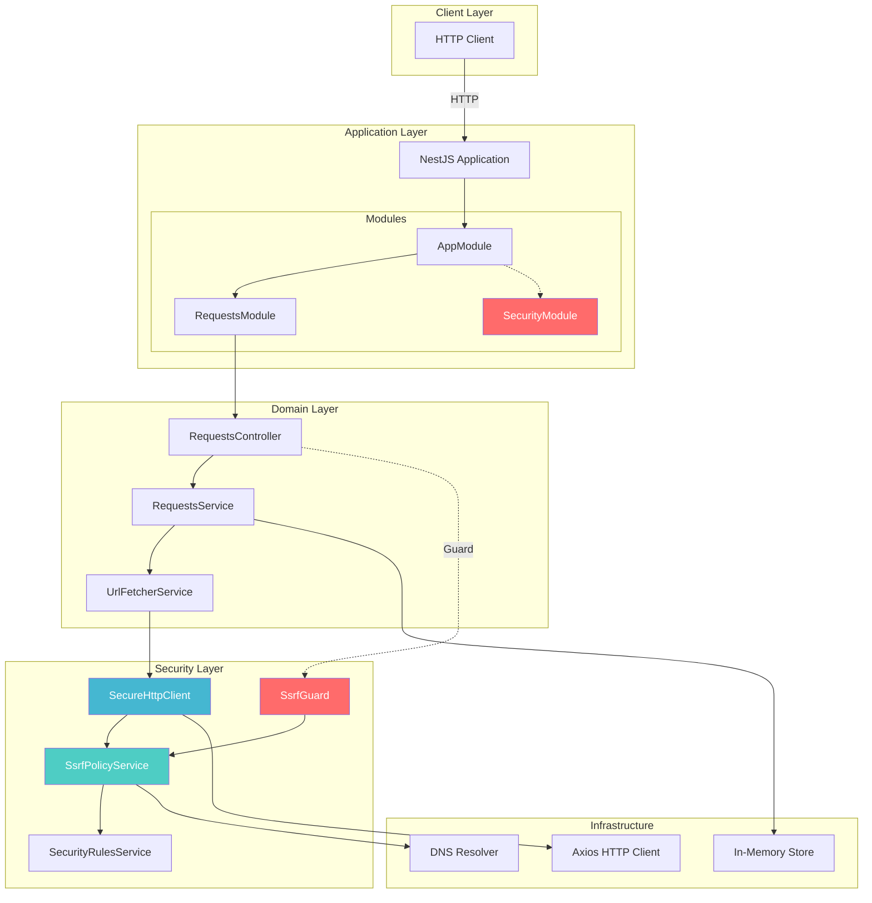
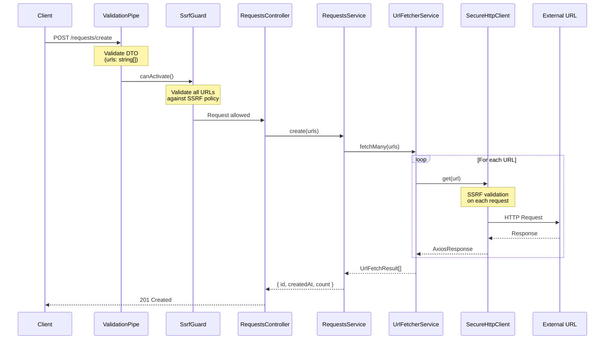
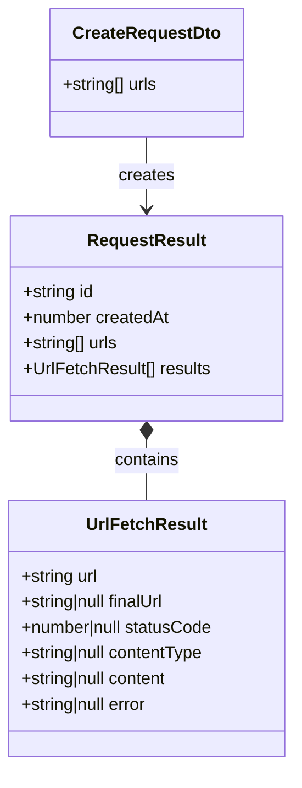
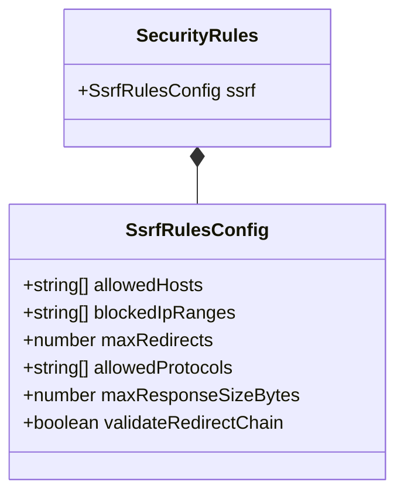
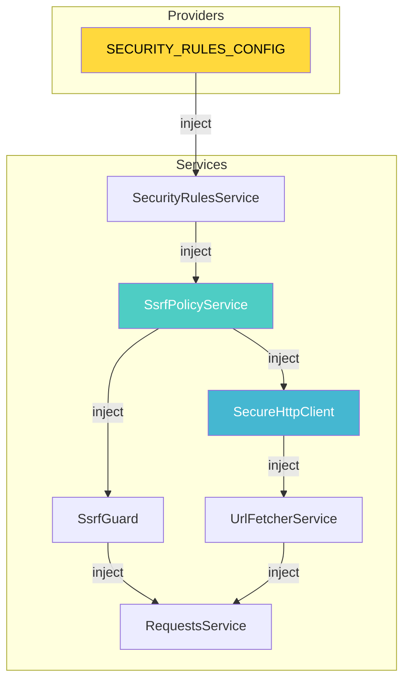
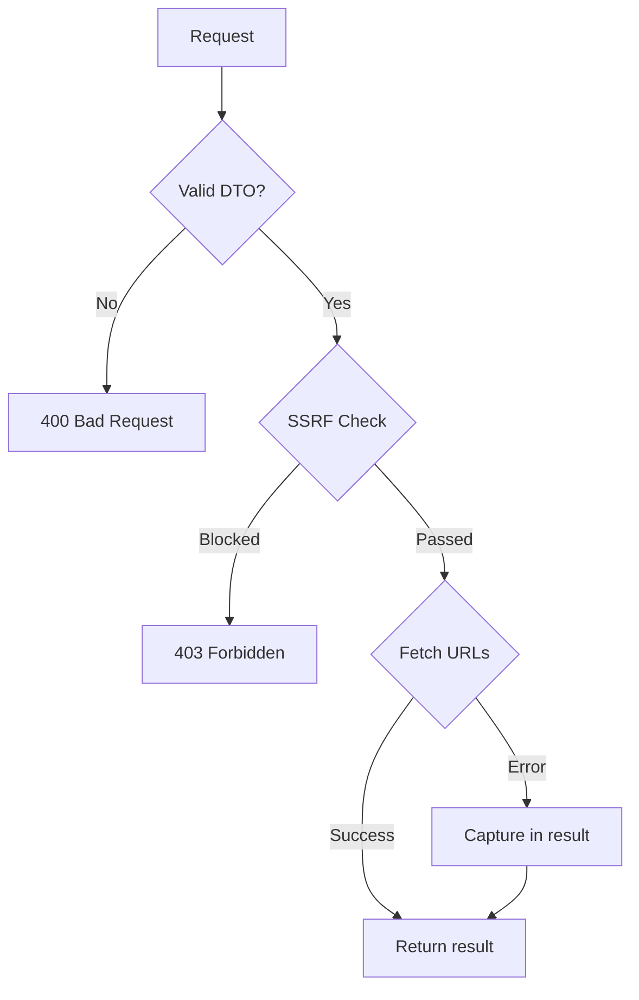

# Architecture Overview

> System architecture and component relationships for URL Fetcher

## High-Level Architecture



## Module Structure

```
src/
├── main.ts                 # Application bootstrap
├── app.module.ts           # Root module
│
├── common/                 # Shared utilities
│   ├── constants.ts        # Application constants
│   ├── normalize-ip.utils.ts  # IP normalization utilities
│   ├── ssrf.util.ts        # Legacy SSRF utilities
│   └── ssrf.util.spec.ts   # Unit tests
│
├── requests/               # Requests feature module
│   ├── requests.module.ts
│   ├── requests.controller.ts
│   ├── requests.service.ts
│   ├── url-fetcher.service.ts
│   ├── dto/
│   │   └── create-requests.dto.ts
│   └── models/
│       └── request-result.model.ts
│
└── security/               # Security module
    ├── security.module.ts
    ├── guards/
    │   └── ssrf.guard.ts
    ├── http/
    │   ├── secure-http.clents.ts
    │   └── security-axios.adapter.ts
    ├── policy/
    │   └── ssrf-policy.service.ts
    └── rules/
        ├── rules.provider.ts
        └── rules.service.ts
```

## Request Lifecycle



## Component Responsibilities

### Controller Layer

| Component | Responsibility |
|-----------|----------------|
| `RequestsController` | HTTP endpoints, request/response handling |

### Service Layer

| Component | Responsibility |
|-----------|----------------|
| `RequestsService` | Business logic, request storage |
| `UrlFetcherService` | URL fetching orchestration |

### Security Layer

| Component | Responsibility |
|-----------|----------------|
| `SsrfGuard` | Pre-request URL validation |
| `SsrfPolicyService` | SSRF validation logic |
| `SecureHttpClient` | SSRF-protected HTTP client |
| `SecurityRulesService` | Security configuration access |
| `SecurityAxiosAdapter` | Request-level SSRF interception |

## Data Models

### Request Flow



### Security Configuration



## Dependency Injection Graph



## API Endpoints

| Method | Endpoint | Description | Guards |
|--------|----------|-------------|--------|
| `POST` | `/requests/create` | Create URL fetch request | `SsrfGuard` |
| `GET` | `/requests/:id` | Get request result by ID | - |

### Request/Response Examples

#### Create Request

```http
POST /requests/create HTTP/1.1
Content-Type: application/json

{
  "urls": [
    "https://example.com",
    "https://httpbin.org/get"
  ]
}
```

```json
{
  "id": "req_1733500800000",
  "createdAt": 1733500800000,
  "count": 2
}
```

#### Get Result

```http
GET /requests/req_1733500800000 HTTP/1.1
```

```json
{
  "id": "req_1733500800000",
  "createdAt": 1733500800000,
  "urls": ["https://example.com", "https://httpbin.org/get"],
  "results": [
    {
      "url": "https://example.com",
      "finalUrl": "https://example.com/",
      "statusCode": 200,
      "contentType": "text/html",
      "content": "<!doctype html>...",
      "error": null
    }
  ]
}
```

## Configuration

### Environment Variables

| Variable | Default | Description |
|----------|---------|-------------|
| `PORT` | `3000` | Server port |

### Application Constants

```typescript
// src/common/constants.ts
MAX_URLS_PER_REQUEST = 100      // Max URLs per batch
HTTP_TIMEOUT_MS = 5000          // Request timeout
MAX_CONTENT_LENGTH_BYTES = 2MB  // Max response size
MAX_REDIRECTS = 5               // Max redirect hops
```

## Error Handling

### HTTP Exceptions

| Status | Exception | Trigger |
|--------|-----------|---------|
| `400` | `BadRequestException` | Invalid DTO |
| `403` | `ForbiddenException` | SSRF blocked |
| `404` | `NotFoundException` | Request ID not found |

### Error Flow



## Testing Strategy

### Unit Tests

- `ssrf.util.spec.ts` - IP validation functions
- Mock DNS resolution for deterministic testing
- Test all private IP ranges

### E2E Tests

- `app.e2e-spec.ts` - API endpoint testing
- Supertest for HTTP assertions

### Running Tests

```bash
# Unit tests
npm test

# Watch mode
npm run test:watch

# E2E tests
npm run test:e2e

# Coverage
npm run test:cov
```
