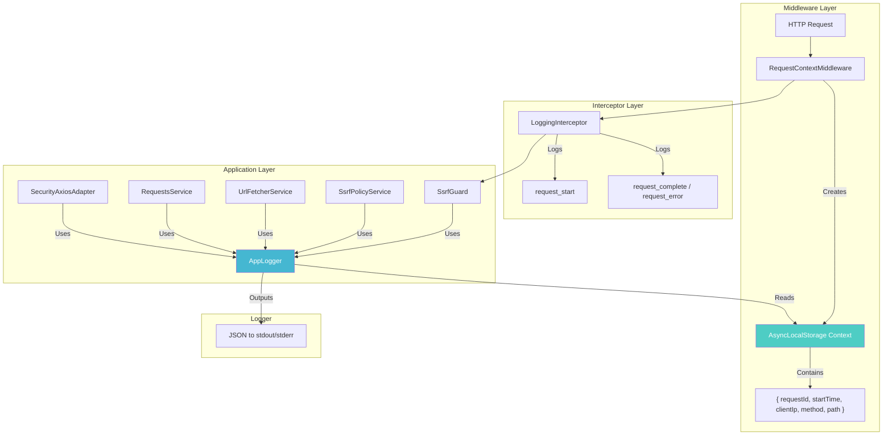
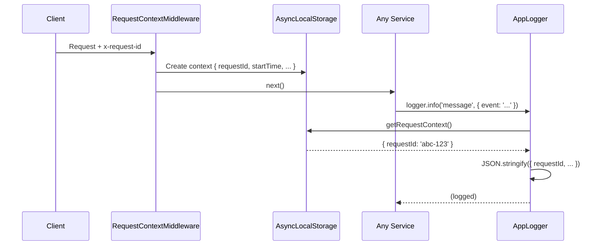

# Logging & Observability

> Structured logging system with request tracing for URL Fetcher

## Table of Contents

- [Overview](#overview)
- [Architecture](#architecture)
- [Request Context](#request-context)
- [AppLogger](#applogger)
- [Log Format](#log-format)
- [Events Reference](#events-reference)
- [Configuration](#configuration)
- [Best Practices](#best-practices)

---

## Overview

The logging system provides **structured JSON logging** with automatic **request tracing** via `x-request-id` headers. All logs include contextual information allowing correlation of events across the entire request lifecycle.

### Key Features

| Feature | Description |
|---------|-------------|
| 📋 **Structured JSON** | All logs output as JSON for easy parsing |
| 🔗 **Request ID Tracing** | Automatic `requestId` in every log entry |
| 🏷️ **Semantic Events** | Named events (`event: 'ssrf_blocked'`) for filtering |
| ⏱️ **Duration Tracking** | Request/operation timing built-in |
| 🧩 **Context Propagation** | AsyncLocalStorage for cross-service context |

---

## Architecture



### Module Structure

```
src/common/
├── context/
│   └── request-context.ts      # AsyncLocalStorage for request context
├── interceptors/
│   └── logging.interceptor.ts  # HTTP request/response logging
├── logger/
│   ├── app-logger.service.ts   # Structured JSON logger
│   └── logger.module.ts        # Global logger module
└── middleware/
    └── request-context.middleware.ts  # Request ID + context setup
```

---

## Request Context

The request context is stored in `AsyncLocalStorage` and automatically propagated through all async operations within a request.

### Context Data

```typescript
interface RequestContext {
  requestId: string;   // UUID or from x-request-id header
  startTime: number;   // Request start timestamp
  clientIp?: string;   // Client IP address
  method?: string;     // HTTP method
  path?: string;       // Request path
}
```

### How It Works



### Usage

```typescript
import { getRequestContext, getRequestId } from 'src/common/context/request-context';

// Get full context
const ctx = getRequestContext();
console.log(ctx?.requestId, ctx?.startTime);

// Get just request ID
const requestId = getRequestId();
```

---

## AppLogger

The `AppLogger` is a NestJS-compatible logger that outputs structured JSON with automatic request context inclusion.

### Creating a Logger

```typescript
import { AppLogger } from 'src/common/logger/app-logger.service';

@Injectable()
export class MyService {
  // Create instance logger with context name
  private readonly logger = AppLogger.create('MyService');

  doSomething() {
    this.logger.info('Operation started', {
      event: 'operation_start',
      someData: 123,
    });
  }
}
```

### API Reference

| Method | Level | Description |
|--------|-------|-------------|
| `log(message, context?)` | info | Standard log (NestJS compatible) |
| `info(message, context?)` | info | Informational message |
| `warn(message, context?)` | warn | Warning message |
| `error(message, context?, trace?)` | error | Error with optional stack trace |
| `debug(message, context?)` | debug | Debug information |
| `verbose(message, context?)` | verbose | Verbose/trace level |
| `fatal(message, context?)` | fatal | Critical errors |

### Context Object

Pass structured data as the second argument:

```typescript
this.logger.info('User action', {
  event: 'user_login',      // Semantic event name
  userId: 123,              // Custom fields
  action: 'login',
  durationMs: 45,
});
```

---

## Log Format

All logs are output as single-line JSON:

### Example Output

```json
{
  "timestamp": "2025-12-06T12:00:00.000Z",
  "level": "info",
  "message": "Request completed",
  "context": "HTTP",
  "requestId": "550e8400-e29b-41d4-a716-446655440000",
  "event": "request_complete",
  "method": "POST",
  "path": "/requests/create",
  "statusCode": 201,
  "durationMs": 342
}
```

### Field Descriptions

| Field | Type | Description |
|-------|------|-------------|
| `timestamp` | ISO 8601 | When the log was created |
| `level` | string | Log level (info, warn, error, debug) |
| `message` | string | Human-readable message |
| `context` | string | Logger name (service/component) |
| `requestId` | UUID | Request correlation ID |
| `event` | string | Semantic event name for filtering |
| `...` | any | Additional context fields |

---

## Events Reference

### HTTP Layer Events

| Event | Level | Description | Fields |
|-------|-------|-------------|--------|
| `request_start` | info | Incoming HTTP request | method, path, urlCount, clientIp |
| `request_complete` | info | Request finished successfully | method, path, statusCode, durationMs |
| `request_error` | error | Request failed | method, path, statusCode, errorMessage, durationMs |

### Security Layer Events

| Event | Level | Description | Fields |
|-------|-------|-------------|--------|
| `guard_validate_start` | debug | SsrfGuard starting validation | urlCount |
| `guard_validate_success` | debug | All URLs passed validation | urlCount |
| `guard_no_urls` | warn | No URLs in request body | - |
| `ssrf_allowlist_blocked` | warn | Host not in allowlist | host, url |
| `ssrf_blocked` | warn | SSRF attempt blocked | host, resolvedIp, url, reason |
| `ssrf_dns_resolved` | debug | DNS lookup completed | host, resolvedIp |
| `ssrf_ip_direct` | debug | Host is IP (no DNS needed) | host |

### HTTP Client Events

| Event | Level | Description | Fields |
|-------|-------|-------------|--------|
| `http_validate_start` | debug | Validating URL before request | url |
| `http_validate_success` | debug | URL validation passed | url |
| `http_redirect` | debug | Following redirect | fromUrl, toUrl, redirectCount, statusCode |
| `http_max_redirects` | warn | Max redirects exceeded | url, redirectCount, maxRedirects |

### Fetch Service Events

| Event | Level | Description | Fields |
|-------|-------|-------------|--------|
| `fetch_batch_start` | debug | Starting batch fetch | urlCount |
| `fetch_batch_complete` | info | Batch fetch completed | urlCount, successCount, errorCount |
| `fetch_success` | debug | Single URL fetched | url, finalUrl, statusCode, durationMs |
| `fetch_error` | error | URL fetch failed | url, error, durationMs |
| `fetch_parse_error` | warn | Content parsing failed | url, error |

### Request Service Events

| Event | Level | Description | Fields |
|-------|-------|-------------|--------|
| `request_create_start` | info | Creating new fetch request | requestId, urlCount |
| `request_create_complete` | info | Request completed | requestId, urlCount, successCount, errorCount |
| `request_get` | debug | Request retrieved | requestId, urlCount |
| `request_not_found` | warn | Request ID not found | requestId |

---

## Configuration

### Request ID Header

The `x-request-id` header is used for request tracing:

```bash
# Client can provide their own request ID
curl -H "x-request-id: my-trace-123" http://localhost:3000/requests/create ...

# Response includes the same ID
# x-request-id: my-trace-123
```

If no header is provided, a UUID is generated automatically.

### Global Logger Setup

The logger is configured in `main.ts`:

```typescript
// main.ts
const logger = AppLogger.create('Application');
app.useLogger(logger);
```

### Module Registration

The `LoggerModule` is registered globally in `AppModule`:

```typescript
// app.module.ts
@Module({
  imports: [
    LoggerModule,  // Global logger
    // ...
  ],
  providers: [
    {
      provide: APP_INTERCEPTOR,
      useClass: LoggingInterceptor,  // HTTP logging
    },
  ],
})
export class AppModule implements NestModule {
  configure(consumer: MiddlewareConsumer) {
    consumer.apply(RequestContextMiddleware).forRoutes('*');
  }
}
```

---

## Best Practices

### ✅ Do's

| Practice | Example |
|----------|---------|
| **Use semantic event names** | `event: 'ssrf_blocked'` |
| **Include relevant context** | `{ url, host, resolvedIp }` |
| **Use appropriate levels** | warn for blocked requests, debug for flow |
| **Add duration for operations** | `{ durationMs: Date.now() - startTime }` |
| **Use instance loggers** | `AppLogger.create('ClassName')` |

### ❌ Don'ts

| Anti-Pattern | Problem |
|--------------|---------|
| Logging sensitive data | PII, credentials in logs |
| Missing event names | Can't filter/search effectively |
| console.log directly | Bypasses structured logging |
| Logging in loops without throttling | Log spam, performance impact |

### Example: Good Logging

```typescript
// ✅ Good
this.logger.warn('SSRF attempt blocked', {
  event: 'ssrf_blocked',
  host: parsed.hostname,
  resolvedIp: address,
  reason: 'private_ip',
});

// ❌ Bad
this.logger.warn(`SSRF blocked for ${url}`);
console.log('blocked', ip);
```

---

## Querying Logs

### Filter by Event Type

```bash
# Find all SSRF blocks
cat logs.json | jq 'select(.event == "ssrf_blocked")'

# Find slow requests (>1s)
cat logs.json | jq 'select(.durationMs > 1000)'
```

### Trace a Request

```bash
# Follow single request through system
cat logs.json | jq 'select(.requestId == "abc-123")'
```

### Count Events

```bash
# Count events by type
cat logs.json | jq -s 'group_by(.event) | map({event: .[0].event, count: length})'
```

---

## Integration Examples

### With Log Aggregators

The JSON format works directly with:
- **ELK Stack** (Elasticsearch, Logstash, Kibana)
- **Grafana Loki**
- **Datadog**
- **AWS CloudWatch**
- **Google Cloud Logging**

### Production Configuration

For production, consider:

```typescript
// Future enhancement example
const logger = new AppLogger({
  level: process.env.LOG_LEVEL || 'info',
  prettyPrint: process.env.NODE_ENV === 'development',
  redactPaths: ['password', 'token', 'authorization'],
});
```

---

## Troubleshooting

### Request ID Not Appearing

**Cause:** Logger called outside request context (e.g., in module initialization).

**Solution:** Request ID only available during HTTP request handling. For startup logs, it will be `undefined`.

### Logs Not in JSON Format

**Cause:** Something is using `console.log` directly.

**Solution:** Find and replace with `AppLogger`:

```bash
# Find console.log usage
grep -r "console.log" src/
```

### Missing Context in Logs

**Cause:** Service not using instance logger.

**Solution:** Create logger with context:

```typescript
// ❌ Wrong
console.log('message');

// ✅ Correct
private readonly logger = AppLogger.create('ServiceName');
this.logger.info('message', { event: 'event_name' });
```
