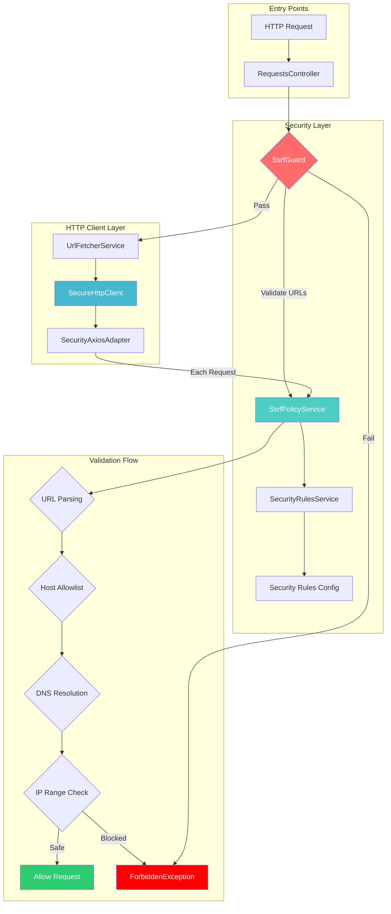
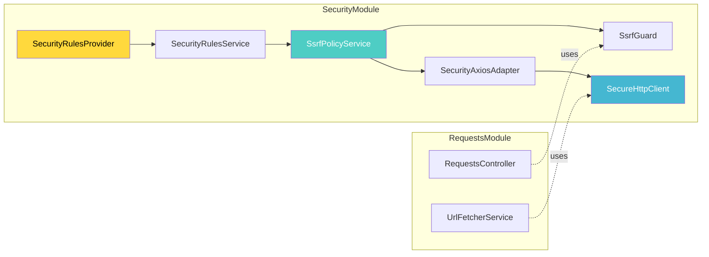
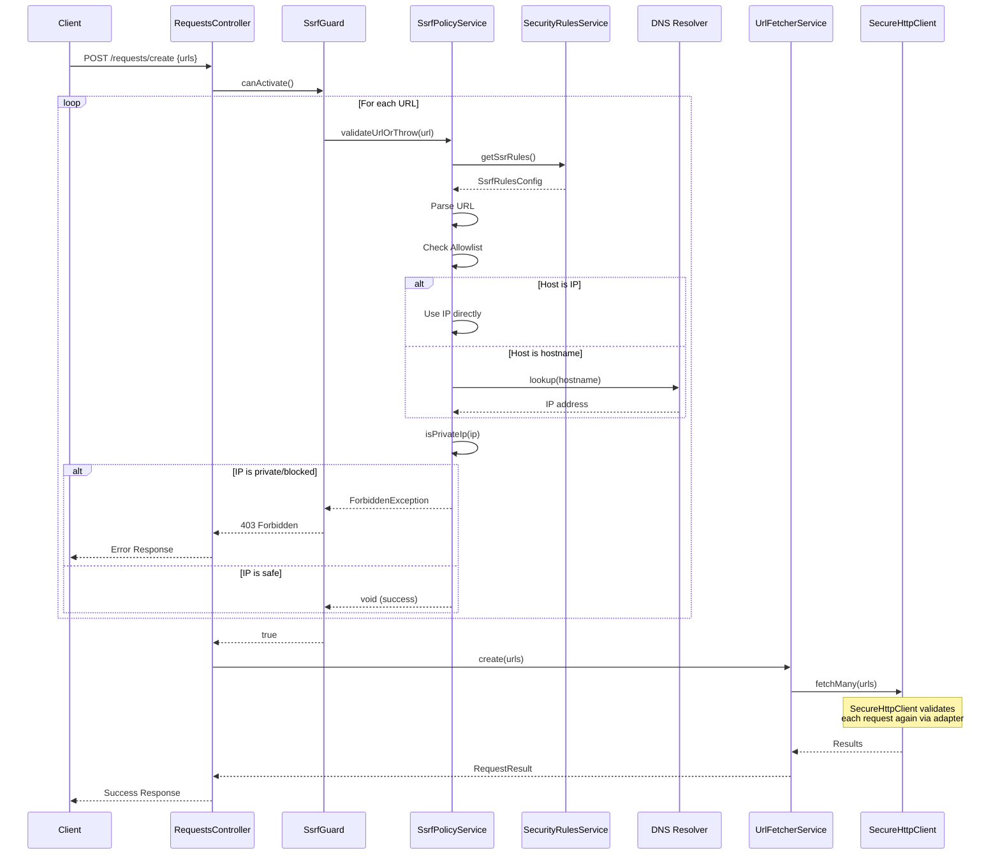
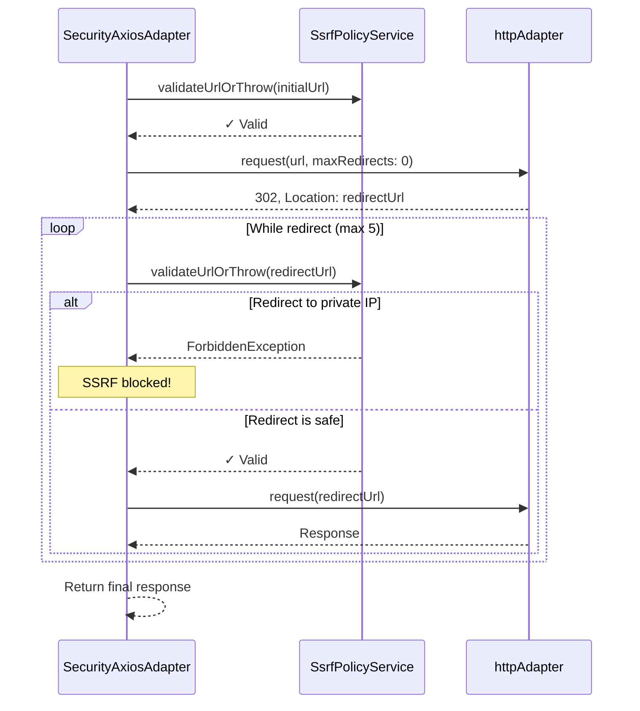
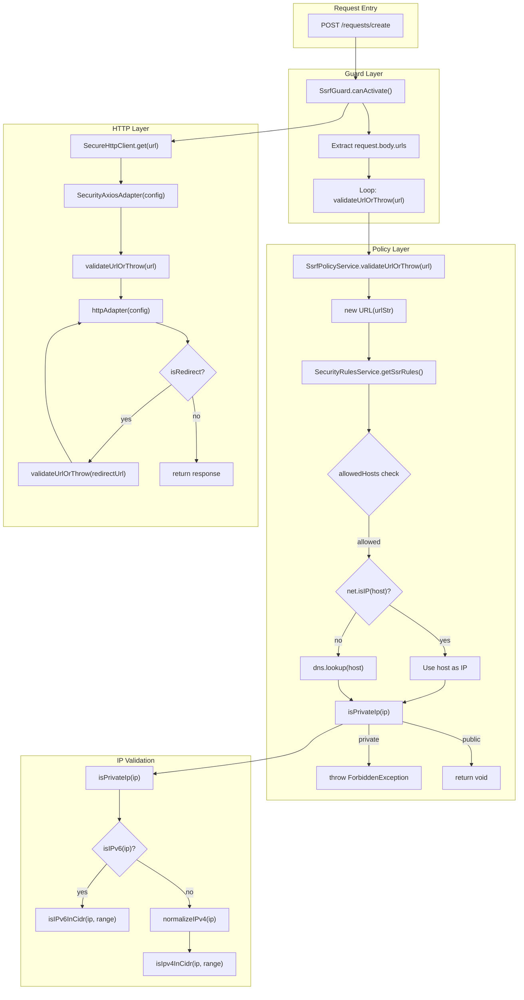

# Security Module Documentation

> Comprehensive documentation for the SSRF protection system in URL Fetcher

## Table of Contents

- [Overview](#overview)
- [Architecture](#architecture)
- [Data Flow](#data-flow)
- [Components](#components)
- [Function Call Schema](#function-call-schema)
- [Configuration](#configuration)
- [Extension Guide](#extension-guide)
- [Best Practices](#best-practices)

---

## Overview

The Security Module provides **defense-in-depth protection** against Server-Side Request Forgery (SSRF) attacks. It implements multiple layers of security validation to ensure that the application only makes HTTP requests to safe, public endpoints.

### Key Features

| Feature | Description |
|---------|-------------|
| 🛡️ **IP Range Blocking** | Blocks private, loopback, link-local, and multicast IP ranges |
| 🔄 **Redirect Chain Validation** | Validates every URL in redirect chains |
| 🌐 **DNS Resolution Check** | Resolves hostnames to IPs before validation |
| ⚙️ **Configurable Rules** | Centralized, injectable security configuration |
| 🔌 **Axios Integration** | Custom adapter for transparent protection |

---

## Architecture



### Module Dependency Graph



---

## Data Flow

### Request Validation Flow



### Redirect Handling Flow



---

## Components

### 1. SecurityRulesProvider

**Location:** `src/security/rules/rules.provider.ts`

Provides the security configuration as an injectable dependency.

```typescript
const securityRulesConfig: SecurityRules = {
    ssrf: {
        allowedHosts: ['*'],           // Host allowlist ('*' = all)
        blockedIpRanges: [...],        // CIDR ranges to block
        maxRedirects: 5,               // Maximum redirect hops
        validateRedirectChain: true,   // Validate each redirect
        allowedProtocols: ['http:', 'https:'],
        maxResponseSizeBytes: 5MB,
    }
}
```

### 2. SecurityRulesService

**Location:** `src/security/rules/rules.service.ts`

Service wrapper for accessing security rules throughout the application.

```typescript
@Injectable()
export class SecurityRulesService {
    getSsrRules(): SsrfRulesConfig    // Get SSRF-specific rules
    getSecurityRules(): SecurityRules  // Get all security rules
}
```

### 3. SsrfPolicyService

**Location:** `src/security/policy/ssrf-policy.service.ts`

Core validation logic for SSRF protection.

```typescript
@Injectable()
export class SsrfPolicyService {
    validateUrlOrThrow(url: string): Promise<void>  // Main validation method
    isPrivateIp(ip: string): boolean                // IP range checking
    getSecurityRules(): SecurityRules               // Access rules
}
```

### 4. SsrfGuard

**Location:** `src/security/guards/ssrf.guard.ts`

NestJS guard for request-level URL validation.

```typescript
@Injectable()
export class SsrfGuard implements CanActivate {
    canActivate(context: ExecutionContext): Promise<boolean>
}
```

### 5. SecureHttpClient

**Location:** `src/security/http/secure-http.clents.ts`

Pre-configured Axios instance with SSRF protection.

```typescript
@Injectable()
export class SecureHttpClient {
    get: AxiosInstance['get'];
    post: AxiosInstance['post'];
    put: AxiosInstance['put'];
    delete: AxiosInstance['delete'];
    patch: AxiosInstance['patch'];
    options: AxiosInstance['options'];
    head: AxiosInstance['head'];
}
```

### 6. SecurityAxiosAdapter

**Location:** `src/security/http/security-axios.adapter.ts`

Custom Axios adapter that intercepts and validates all requests.

```typescript
function createSecurityAxiosAdapter(
    ssrfPolicy: SsrfPolicyService
): AxiosAdapter
```

---

## Function Call Schema

### Complete Call Graph



### Method Signatures Reference

| Component | Method | Input | Output | Throws |
|-----------|--------|-------|--------|--------|
| `SsrfGuard` | `canActivate(ctx)` | `ExecutionContext` | `Promise<boolean>` | `ForbiddenException` |
| `SsrfPolicyService` | `validateUrlOrThrow(url)` | `string` | `Promise<void>` | `ForbiddenException` |
| `SsrfPolicyService` | `isPrivateIp(ip)` | `string` | `boolean` | - |
| `SecurityRulesService` | `getSsrRules()` | - | `SsrfRulesConfig` | - |
| `SecureHttpClient` | `get(url, config?)` | `string, AxiosRequestConfig?` | `Promise<AxiosResponse>` | `Error` |
| `normalizeIPv4` | `(ip)` | `string` | `string \| null` | - |
| `isIpv4InCidr` | `(ip, cidr)` | `string, string` | `boolean` | - |
| `isIPv6InCidr` | `(ip, cidr)` | `string, string` | `boolean` | - |

---

## Configuration

### Default Blocked IP Ranges

| Range | Type | Purpose |
|-------|------|---------|
| `127.0.0.1/8` | IPv4 Loopback | Localhost protection |
| `10.0.0.0/8` | IPv4 Private | RFC1918 Class A |
| `172.16.0.0/12` | IPv4 Private | RFC1918 Class B |
| `192.168.0.0/16` | IPv4 Private | RFC1918 Class C |
| `169.254.0.0/16` | IPv4 Link-Local | AWS metadata, APIPA |
| `224.0.0.0/4` | IPv4 Multicast | Multicast addresses |
| `::1/128` | IPv6 Loopback | Localhost IPv6 |
| `fe80::/10` | IPv6 Link-Local | Link-local IPv6 |
| `fc00::/7` | IPv6 Unique-Local | Private IPv6 |

### Configuration Options

```typescript
interface SsrfRulesConfig {
    allowedHosts: string[];        // ['*'] or specific hosts
    blockedIpRanges: string[];     // CIDR notation
    maxRedirects: number;          // Default: 5
    allowedProtocols: string[];    // ['http:', 'https:']
    maxResponseSizeBytes: number;  // Default: 5MB
    validateRedirectChain: boolean; // Default: true
}
```

---

## Extension Guide

### Adding New Security Rules

#### Step 1: Extend the Rules Interface

```typescript
// src/security/rules/rules.service.ts
export interface SecurityRules {
    ssrf: SsrfRulesConfig;
    // Add new rule categories:
    rateLimit?: RateLimitConfig;
    contentPolicy?: ContentPolicyConfig;
}
```

#### Step 2: Update the Provider

```typescript
// src/security/rules/rules.provider.ts
const securityRulesConfig: SecurityRules = {
    ssrf: { /* existing config */ },
    rateLimit: {
        maxRequestsPerMinute: 100,
        windowMs: 60000,
    }
}
```

#### Step 3: Create a New Guard (if needed)

```typescript
// src/security/guards/rate-limit.guard.ts
@Injectable()
export class RateLimitGuard implements CanActivate {
    constructor(private readonly rules: SecurityRulesService) {}
    
    canActivate(context: ExecutionContext): boolean {
        const config = this.rules.getSecurityRules().rateLimit;
        // Implementation
    }
}
```

### Adding Custom IP Ranges to Block

```typescript
// src/security/rules/rules.provider.ts
blockedIpRanges: [
    // Existing ranges...
    
    // Add custom ranges:
    '100.64.0.0/10',    // Carrier-grade NAT
    '198.18.0.0/15',    // Network benchmark testing
    '203.0.113.0/24',   // Documentation (TEST-NET-3)
]
```

### Creating a Custom Validation Rule

```typescript
// src/security/policy/custom-validator.ts
@Injectable()
export class CustomUrlValidator {
    constructor(private readonly rules: SecurityRulesService) {}
    
    async validate(url: string): Promise<void> {
        const parsed = new URL(url);
        
        // Custom validation logic
        if (parsed.port && this.isBlockedPort(parsed.port)) {
            throw new ForbiddenException(`Port ${parsed.port} is blocked`);
        }
    }
    
    private isBlockedPort(port: string): boolean {
        const blocked = ['22', '23', '3389', '5900']; // SSH, Telnet, RDP, VNC
        return blocked.includes(port);
    }
}
```

### Extending the Axios Adapter

```typescript
// src/security/http/security-axios.adapter.ts
export function createSecurityAxiosAdapter(
    ssrfPolicy: SsrfPolicyService,
    customValidator?: CustomUrlValidator, // Add custom validators
): AxiosAdapter {
    return async function(config: AxiosRequestConfig): Promise<AxiosResponse> {
        // Existing validation
        await ssrfPolicy.validateUrlOrThrow(currentUrl);
        
        // Custom validation
        if (customValidator) {
            await customValidator.validate(currentUrl);
        }
        
        // ... rest of implementation
    };
}
```

---

## Best Practices

### ✅ Do's

| Practice | Description |
|----------|-------------|
| **Use SecureHttpClient** | Always use `SecureHttpClient` instead of raw Axios for external requests |
| **Apply SsrfGuard** | Use `@UseGuards(SsrfGuard)` on all endpoints accepting URLs |
| **Validate at multiple layers** | Guard validates input, Adapter validates actual requests |
| **Keep rules centralized** | All security configuration in `rules.provider.ts` |
| **Log blocked attempts** | Monitor `SsrfPolicyService` logs for attack patterns |
| **Test edge cases** | IPv6, decimal IPs, redirect chains, DNS rebinding |

### ❌ Don'ts

| Anti-Pattern | Risk |
|--------------|------|
| Using raw `axios` | Bypasses SSRF protection |
| Hardcoding IP checks | Difficult to maintain, easy to miss ranges |
| Skipping DNS resolution | DNS rebinding attacks |
| Ignoring redirects | Redirect-based SSRF bypasses |
| Trusting localhost | `localhost` can resolve to various IPs |

### Security Checklist

- [ ] All HTTP client usage goes through `SecureHttpClient`
- [ ] User-provided URLs are validated before use
- [ ] Redirect chain validation is enabled
- [ ] Private IP ranges include cloud metadata endpoints
- [ ] IPv6 ranges are properly blocked
- [ ] DNS resolution is performed before IP validation
- [ ] Logs are monitored for SSRF attempts
- [ ] Tests cover bypass techniques (octal IPs, integer IPs, etc.)

---

## Troubleshooting

### Common Issues

#### "Host not allowed by SSRF policy"

**Cause:** The hostname is not in `allowedHosts` and wildcard (`*`) is not enabled.

**Solution:** Add the host to `allowedHosts` or use `['*']` for all hosts.

#### "SSRF blocked: private IP"

**Cause:** The URL resolves to a private/internal IP address.

**Solution:** This is working as intended. If this is a false positive:
1. Verify the hostname doesn't resolve to a private IP
2. Check if a proxy or VPN is affecting DNS resolution

#### Redirect loop or max redirects exceeded

**Cause:** The target URL redirects more than `maxRedirects` times.

**Solution:** Increase `maxRedirects` in configuration or investigate the redirect chain.

---

## API Reference

### Exported from SecurityModule

| Export | Type | Description |
|--------|------|-------------|
| `SecureHttpClient` | Service | SSRF-protected HTTP client |
| `SsrfGuard` | Guard | NestJS guard for URL validation |
| `SecurityRulesService` | Service | Access to security configuration |

### Usage Example

```typescript
import { SecurityModule } from 'src/security/security.module';
import { SecureHttpClient } from 'src/security/http/secure-http.clents';
import { SsrfGuard } from 'src/security/guards/ssrf.guard';

@Module({
    imports: [SecurityModule],
})
export class YourModule {}

@Controller()
export class YourController {
    constructor(private readonly http: SecureHttpClient) {}
    
    @Post()
    @UseGuards(SsrfGuard)
    async fetchUrl(@Body('url') url: string) {
        return this.http.get(url);
    }
}
```

---

## References

- [OWASP SSRF Prevention Cheat Sheet](https://cheatsheetseries.owasp.org/cheatsheets/Server_Side_Request_Forgery_Prevention_Cheat_Sheet.html)
- [RFC1918 - Private IP Ranges](https://datatracker.ietf.org/doc/html/rfc1918)
- [AWS Instance Metadata Service (IMDS)](https://docs.aws.amazon.com/AWSEC2/latest/UserGuide/ec2-instance-metadata.html)
- [NestJS Guards Documentation](https://docs.nestjs.com/guards)
